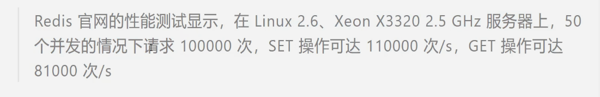

## 由来

2008意大利公司Merzia推出基于mysql的网站实时统计系统LLOOGG，创始人对mysql性能不满，亲自为LLOOGG做个数据库， 2009年完成。

后来各个公司不断赞助

## 什么是Redis

Redis是一个使用ANSIC编写的开源，支持网络，基于内存，可选持久性的键值对存储数据库。

不是简单的key-value, 支持数据结构。

所有数据都存在内存中，读写速度快，程序退出，数据丢失。持久化的话，将内存中的数据异步写入到硬盘。

以字典结构存储数据，并允许其他应用通过tcp

协议读取内容。

- 字符串
- 哈希
- 列表
- 集合
- 带范围查询的排序集合
- 位图
- 超日志
- 带有半径查询和流的地理空间索引
- 。。。。

## 应用

### 特点：

- 读写性能好，持久化，数据类型丰富，单线程，数据自动过期，发布订阅，分布式。

1. #### 缓存系统

   为每个键设置生存时间，生存时间到期自动删除。也可限定数据占据的最大空间，达到空间限制按照一定的规则自动淘汰不需要的。

2. #### 队列系统

   列表类型键可以实现队列，支持阻塞式读取，容易实现一个高性能的优先级队列。

3. #### 发布订阅

   聊天室。。。

4. #### 排行榜

5. #### 计数器

6. #### 分布式会话

   session相关

7. #### 分布式锁

   分布式主要是对同一资源的并发访问的问题。

   redis的setnx功能来实现

8. #### 社交网络

   点赞，关注，访问量大

9. #### 列表结构

## 命令列表

https://redis.io.commands

不同编程语言也可操作redis

## 版本号

2.7, 2.9第二位为奇数，非稳定

偶数稳定

当前奇数是下一个稳定版本的开发版本

