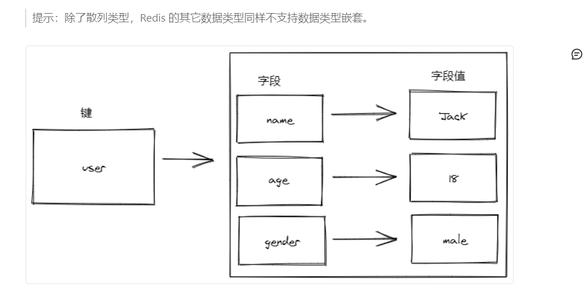
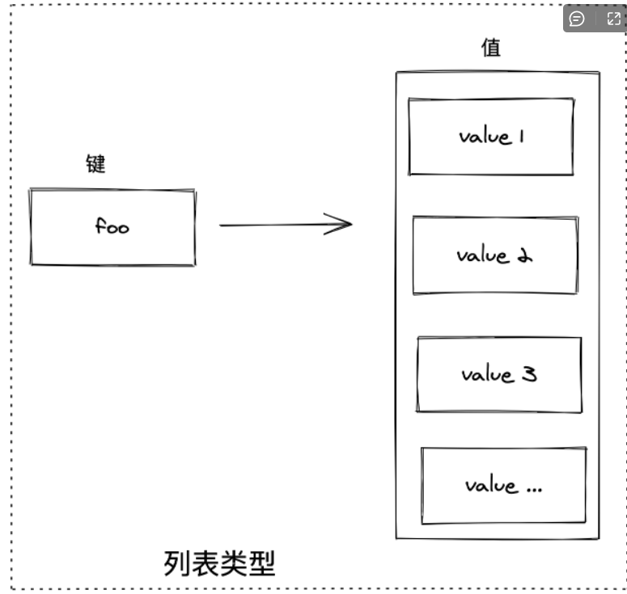
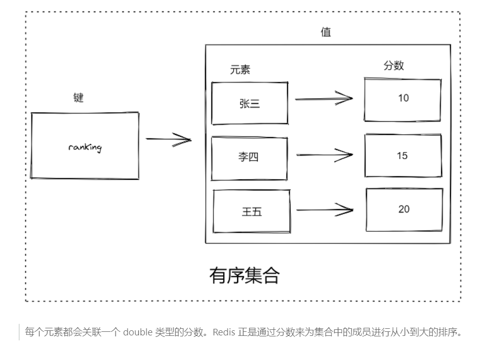
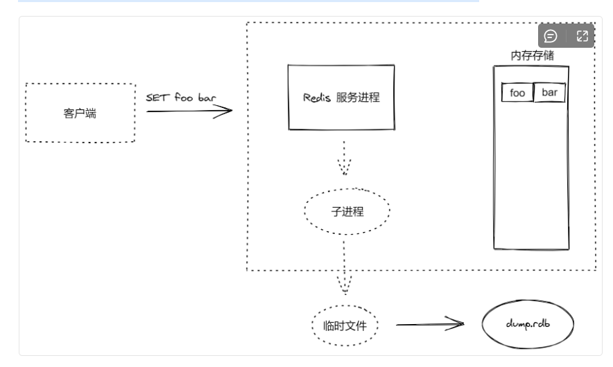

## 由来

2008意大利公司Merzia推出基于mysql的网站实时统计系统LLOOGG，创始人对mysql性能不满，亲自为LLOOGG做个数据库， 2009年完成。

后来各个公司不断赞助

## 什么是Redis

Redis是一个使用ANSIC编写的开源，支持网络，基于内存，可选持久性的键值对存储数据库。

不是简单的key-value, 支持数据结构。

所有数据都存在内存中，读写速度快，程序退出，数据丢失。持久化的话，将内存中的数据异步写入到硬盘。

以字典结构存储数据，并允许其他应用通过tcp

协议读取内容。


- 字符串
- 哈希
- 列表
- 集合
- 带范围查询的排序集合
- 位图
- 超日志
- 带有半径查询和流的地理空间索引
- 。。。。

## 应用

### 特点：

- 读写性能好，持久化，数据类型丰富，单线程，数据自动过期，发布订阅，分布式。

1. #### 缓存系统

   为每个键设置生存时间，生存时间到期自动删除。也可限定数据占据的最大空间，达到空间限制按照一定的规则自动淘汰不需要的。

2. #### 队列系统

   列表类型键可以实现队列，支持阻塞式读取，容易实现一个高性能的优先级队列。

3. #### 发布订阅

   聊天室。。。

4. #### 排行榜

5. #### 计数器

6. #### 分布式会话

   session相关

7. #### 分布式锁

   分布式主要是对同一资源的并发访问的问题。

   redis的setnx功能来实现

8. #### 社交网络

   点赞，关注，访问量大

9. #### 列表结构

## 命令列表

https://redis.io.commands

不同编程语言也可操作redis

## 版本号

2.7, 2.9第二位为奇数，非稳定

偶数稳定

当前奇数是下一个稳定版本的开发版本

## 下载安装

https://www.redis.net.cn/download/

```
$ wget http://download.redis.io/releases/redis-5.0.4.tar.gz
$ tar xzf redis-5.0.4.tar.gz
$ cd redis-5.0.4
$ make
```

二进制文件是编译完成后在`src`目录下. 运行如下:启动redis服务

```
src/redis-server
```

将redis文件安装到/usr/local/bin中

```
make install
```

再redis-server即可运行

## 运行和停止Redis

| 命令             | 说明         |      |
| ---------------- | ------------ | ---- |
| redis-server     | redis服务器  |      |
| redis-cli        | 命令行客户端 |      |
| redis-benchmark  | 性能测试     |      |
| redis-check-aof  | AOF文件修复  |      |
| redis-check-dump | RDB文件检查  |      |
| redis-sentinel   | 哨兵模式工具 |      |

##### 默认6379端口，

```
redis-server -port 1234
```

##### 后台运行redis

```
redis-server --daemonize yes
```

##### 配置文件运行

```
ps -ef | grep -i redis
```

##### 停止redis

```
redis-cli shutdown
```

```
# 进程号的方式
kill -9 541247
```

## 连接redis

redis-cli是redis自带的基于命令行的redis客户端。

##### 连接数据库

```
redis-cli

redis-cli -h 127.0.0.1 -p 1234
```

##### 测试连接是否正常

```
127.0.0.1:6379> PING
PONG   //这个即为正常
```

##### 退出cli环境

```
quit
```

Ctrl + c

## redis配置

1. ##### 命令行参数进行配置

   ```
   redis-server --port 6380 --host 127.0.0.1
   ```

2. 配置文件redis.conf

   建议配置把文件放在/etc/redis中（需要自己创建），创建6379.conf

   ```
   拷贝原先的配置文件到/ect/redis下
   cp /usr/redis/redis-5.0.4/redis.conf 6379.conf
   ```

   1. ##### 配置文件启动

      ```
      redis-server 配置文件路径
      ```

   2. ##### 配置文件结合命令行

      ```
      redis-server 配置文件路径 --port 3000
      ```

##### 	服务器运行时更改部分redis配置

```
redis-cli 
# 日志级别
CONFIG GET logLovel
CONFIG SET logLevel
```

## redis数据库

默认支持16个数据库，编号0，1，2，3，4.。。

##### 一般一个Redis实例用来存放同一个应用的数据

- 不支持自定义数据库名称
- 通过配置参数databases修改支持的数据库个数
- 数据库之间独立
- 建立连接后自动选择0号数据库
- 所有数据库的访问密码相同

##### 更换数据库

```
SELECT 1
```

##### 清空一个redis实例中多有数据库中的数据

```
FLUSHALL
```

## Redis数据类型相关

命令不区分大小写

### 数据类型

- string
- hash
- list
- set
- zset     有序集合，通过每个字段关联的分数，进行排序
- Bit arrays(bitmaps)      可使用特殊命令像位数组一样处理字符串值
- HyperLogLogs        概率数据结构，用于估计集合的基数
- Streams                 提供抽象日志数据类型的类似地图项的仅追加集合 

### 键

空键有效

最大大小512MB

#### 添加

```
redis-cli
SELECT 2
SET foo bar
KEYS *      // 查看所有
```

##### 指定key的值设为value, 返回key的旧值

```
GETSET key value
```

##### 只有在key不存在时设置key的值

```
SEINX key value
```

##### 同时设置一个或多个key-value对

```
MSET key value [key value ...]
```

##### 同时设置一个或多个key-value对,当且仅当所有给定的key都不存在

```
MSET key value [key value ...]
```

#### 查询

##### 获取指定key的值

```
GET key
```

##### 返回key中字符串值的子字符

```
GETRANGE key start end
```

##### 所有给定key的值

```
MGET key [key ...]
```

##### key所存储字符串的长度

```
STRLEN key
```

##### 查询集合中是否有指定的key

```
EXISTS key [key ...]
```

##### 通用命令， 查询key的类型

```
TYPE key
```

#### 修改

```
SET key value

# 将指定key的值设为value,并返回key的旧值（old value）
GETSET key value

# 如果key 已经存咋并且是一个字符串，append加到value的末尾
APPEND key value
```

#### 删除

##### 删除一个或多个key

```
DEL key [key ...]
```

#### 数字值

在redis中以字符串保存

```
SET count 1
GET count
INCR count

# 将key中存的值增加一
INCR key

# 将key中存的值增加指定值(increment)
INCRBY key increment

# 将key中存的值减一
DECR key

# 将key中存的值减指定值
DECRBY key 10
```

### 哈希类型

也叫散列， 字典结构，字段和字段值的映射，**字符值只能是字符串**，



#### 添加

```
# 将哈希表 key 中的字段 field 的值设为 value
HSET key field value [field value ...]

# 同时将多个 field-value (域-值)对设置到哈希表 key 中
HMSET key field value [field value ...]

# 只有在字段 field 不存在时，设置哈希表字段的值
HSETNX key field value
```

#### 查询

```
# 获取所有哈希表中的字段
HKEYS key

# 获取哈希表中字段的数量
HLEN key

# 获取所有给定字段的值
HMGET key field1 [field2]

# 获取存储在哈希表中指定字段的值
HGET key field

# 获取在哈希表中指定 key 的所有字段和值
HGETALL key

# 查看哈希表 key 中，指定的字段是否存在
HEXISTS key field

# 获取哈希表中所有值
HVALS key

# 迭代哈希表中的键值对
HSCAN key cursor [MATCH pattern] [COUNT count]
```

#### 修改

```
# 将哈希表 key 中的字段 field 的值设为 value
HSET key field value [field value ...]

# 为哈希表 key 中的指定字段的整数值加上增量 increment
HINCRBY key field increment
```

#### 删除

```
# 删除一个或多个哈希表字段
HDEL key field1 [field2]

# 删除整个数据字段
DEL key [key ...]
```

### 列表



一个列表最多可以包含 232 - 1 个元素 (4294967295, 每个列表超过40亿个元素)。

#### 添加

```
# 将一个或多个值插入到列表头部
LPUSH key element [element ...]

# 在列表的元素前或者后插入元素
LINSERT key BEFORE|AFTER pivot value

# 将一个值插入到已存在的列表头部
LPUSHX key value

# 通过索引设置列表元素的值
LSET key index value

# 在列表中添加一个或多个值
RPUSH key value1 [value2]

# 为已存在的列表添加值
RPUSHX key value
```

#### 查询

```
# 通过索引获取列表中的元素
LINDEX key index

# 获取列表长度
LLEN key

# 获取列表指定范围内的元素
LRANGE key start stop
```

#### 删除

```
# 移出并获取列表的第一个元素
LPOP key

# 移出并获取列表的第一个元素， 如果列表没有元素会阻塞列表直到等待超时或发现可弹出元素为止
BLPOP key1 [key2 ] timeout

# 移出并获取列表的最后一个元素， 如果列表没有元素会阻塞列表直到等待超时或发现可弹出元素为止
BRPOP key1 [key2 ] timeout

# 从列表中弹出一个值，将弹出的元素插入到另外一个列表中并返回它； 如果列表没有元素会阻塞列表直到等待超时或发现可弹出元素为止
BRPOPLPUSH source destination timeout

# 移除列表元素
# 如果 count > 0，则从头向尾遍历删除元素
# 如果 count < 0，则从后面向前面删除元素
# 如果 count = 0，则删除所有匹配的元素
LREM key count value

# 对一个列表进行修剪(trim)，就是说，让列表只保留指定区间内的元素，不在指定区间之内的元素都将被删除
LTRIM key start stop

# 移除列表的最后一个元素，返回值为移除的元素
RPOP key

# 移除列表的最后一个元素，并将该元素添加到另一个列表并返回
RPOPLPUSH source destination
```

### 集合（SET)

集合中的元素是唯一的、无序的，简单理解集合就是没有顺序且不重复的列表。

#### 添加

```
# 向集合添加一个或多个成员
SADD key member1 [member2]
```

#### 查询

```
# 返回集合中的所有成员
SMEMBERS key

# 获取集合的成员数
SCARD key

# 判断 member 元素是否是集合 key 的成员
SISMEMBER key member

# 返回集合中一个或多个随机数
SRANDMEMBER key [count]
```

#### 删除

```
# 移除集合中一个或多个成员
SREM key member1 [member2]

# 移除并返回集合中的一个随机元素
SPOP key

# 将 member 元素从 source 集合移动到 destination 集合
SMOVE source destination member
```

#### 集合间聚合运算

```
# 返回第一个集合与其他集合之间的差异。
SDIFF key1 [key2]

# 返回给定所有集合的交集
SINTER key1 [key2]

# 返回所有给定集合的并集
SUNION key1 [key2]

# 返回给定所有集合的差集并存储在 destination 中
SDIFFSTORE destination key1 [key2]

# 返回给定所有集合的交集并存储在 destination 中
SINTERSTORE destination key1 [key2]

# 所有给定集合的并集存储在 destination 集合中
SUNIONSTORE destination key1 [key2]
```

##### 使用场景

- 跟踪一些唯一性数据

- - 比如访问网站的唯一 IP 地址信息，每次访问网站的时候记录用户 IP 地址，SET 自动保证数据的唯一不重复

- 充分利用 SET 聚合操作方便高效的特性，用于维护数据对象之间的关联关系

- - 比如所有购买A商品的客户 ID 存储到指定的 SET 中，所有购买B商品的客户 ID 存储到指定的 SET 中，如果我们想要获取有哪个客户同时购买了这两个商品，我们只需要使用交集操作就可以轻松的查出来

### 有序集合（Sorted Set）



##### 有序集合类型在某些方面和列表类型有些相似。

相同点：

- 两者都是有序的
- 两者都可以获得某一范围的元素


不同点：

- 列表类型通过链表实现的，获取靠近两端的数据速度极快，而当元素增多后，访问中间数据的速度会较慢，所以它更适合实现如“新鲜事”或“日志”这样很少访问中间元素的应用
- 有序集合类似是使用哈希表实现的，所以即使读取位于中间部分的数据速度也很快
- 列表中不能简单的调整某个元素的位置，但是有序集合可以（通过更改元素的分数）
- 有序集合要比列表类型更耗费内存

##### 有序集合的典型应用场景：

（1）排行榜

例如一个大型在线游戏的积分排行榜，每当玩家的分数发生变化时，可以执行 `ZADD` 命令更新玩家的分数，此后再通过 `ZRANGE` 命令获取积分 TOPTEN 的用户信息。当然我们也可以利用 `ZRANK` 命令通过 username 来获取玩家的排行信息。最后我们将组合使用 `ZRANGE` 和 `ZRANK` 命令快速的获取和某个玩家积分相近的其他用户的信息。


（2）微博热搜

假设我们现在要获取热门的帖子或搜索，比如我们常用的微博热搜。

首先，我们需要一个衡量的标准，定量的量度热搜的热门程度。假设我们有一个字段叫回复量，回复量越高就越热门。

#### 查询

```
# 通过索引区间返回有序集合指定区间内的成员，分数从低到高排序
ZRANGE key start stop [WITHSCORES]

# 通过索引区间返回有序集合指定区间内的成员，分数从高到低排序
ZREVRANGE key start stop [WITHSCORES]

# 返回有序集中指定分数区间内的成员，分数从低到高排序
ZRANGEBYSCORE key min max [WITHSCORES] [LIMIT offset count]

# 返回有序集中指定分数区间内的成员，分数从高到低排序
ZREVRANGEBYSCORE key max min [WITHSCORES] [LIMIT offset count]

# 返回有序集合中指定成员的排名，有序集成员按分数值（从小到大）排序
ZRANK key member

# 返回有序集合中指定成员的排名，有序集成员按分数值（从大到小）排序
ZREVRANK key member

# 获取有序集合的成员数
ZCARD key

# 返回有序集中，成员的分数值
ZSCORE key member

# 计算在有序集合中指定区间分数的成员数
ZCOUNT key min max
```

#### 修改

```
# 向有序集合添加一个或多个成员，或者更新已存在成员的分数
ZADD key score member [score member ...]

# 有序集合中对指定成员的分数加上增量 increment
ZINCRBY key increment member
```

#### 删除

```
# 移除有序集合中的一个或多个成员
ZREM key member [member ...]

# 移除有序集合中给定的排名区间的所有成员
ZREMRANGEBYRANK key start stop

# 移除有序集合中给定的分数区间的所有成员
ZREMRANGEBYSCORE key min max
```

#### 有序集合间聚合运算

```
# 计算给定的一个或多个有序集的交集并将结果集存储在新的有序集合 destination 中
ZINTERSTORE destination numkeys key [key ...]

# 计算给定的一个或多个有序集的并集，并存储在新的 key 中
ZUNIONSTORE destination numkeys key [key ...]
```

### 通用命令

```
# 返回所有 key
KEYS *

# 返回所有以 my 开头的 key
KEYS my*

# 获取 key 的类型
TYPE key

# 查询某个 key 是否存在
EXISTS key [key ...]

# 将 key 改名为 newkey
RENAME key newkey

# 删除指定 key
DEL key [key ...]

# 从当前数据库中随机返回(不删除)一个 key
RANDOMKEY

# 对 key 进行重命名
RENAME key newkey

# 清空当前数据库所有内容
FLUSHDB

# 清空所有数据库内容
FLUSHALL

# 将当前数据库的 key 移动到给定的数据库 db 当中
MOVE key db
```

## Redis 过期时间

### 设置键的过期时间

```
# 为给定 key 设置生存时间，当 key 过期时(生存时间为 0 )，它会被自动删除。
EXPIRE key seconds

# 和 EXPIRE 一样，但是它以毫秒为单位
PEXPIRE key milliseconds

# EXPIREAT 的作用和 EXPIRE 类似，都用于为 key 设置生存时间。
# 不同在于 EXPIREAT 命令接受的时间参数是 UNIX 时间戳(unix timestamp)。
EXPIREAT key timestamp

# 这个命令和 EXPIREAT 命令类似，但它以毫秒为单位设置 key 的过期 unix 时间戳，而不是像 EXPIREAT 那样，以秒为单位。
PEXPIREAT key milliseconds-timestamp
```

上面这4个命令只是单位和表现形式上的不同，但实际上 EXPIRE、PEXPIRE 以及 EXPIREAT 命令的执行最后都会使用 PEXPIREAT 来实行。

比如使用 `EXPIRE` 来设置 KEY 的生存时间为 N 秒，那么后台是如何运行的呢：

- 它会调用 `PEXPIRE` 命令把 N 秒转换为M毫秒
- 然后获取当前的 UNIX 时间单位也是毫秒
- 把当前 UNIX 时间加上 M 毫秒传递给 `PEXPREAT`

另外给键设置了过期时间，这个时间保存在一个字典里，也是键值结构，键是一个指针，指向真实的键，而值这是一个长整型的 UNIX 时间。

### 获取键的过期时间

```
# 以秒为单位，返回给定 key 的剩余生存时间(TTL, time to live)。
TTL key

# 类似于 TTL，但它以毫秒为单位返回 key 的剩余生存时间。
PTTL key
```

过期时间返回值说明：

| **值** | **说明**                       |
| ------ | ------------------------------ |
| -2     | 过期且已删除                   |
| -1     | 没有过期时间设置，即永不过期   |
| >0     | 表示距离过期还有多少秒或者毫秒 |

### 清除键的过期时间

```
# 移除给定 key 的生存时间，将这个 key 从『易失的』(带生存时间 key )转换成『持久的』(一个不带生存时间、永不过期的 key )。
PERSIST key
```

注意：

- 使用 SET 或 GETSET 命令为键赋值也会同时清除键的过期时间。
- 其它只对键值进行操作的命令（如 INCR、LPUSH、HSET、ZREM）不会影响键的过期时间。

## Redis 事务

### 事务的基础概念

关于事务最常见的例子就是银行转账，A 账户给 B 账户转账一个亿 (T1)，买一块地盖房子。在这种交易的过程中，有几个问题值得思考：

- 如何**同时保证**上述交易中，A账户总金额减少一个亿，B账户总金额增加一个亿？ A
- A账户如果同时在和C账户交易(T2)，如何让这两笔交易互不影响？ I
- 如果交易完成时数据库突然崩溃，如何保证交易数据成功保存在数据库中？ D
- 如何在支持大量交易的同时，保证数据的合法性(没有钱凭空产生或消失) ？ C

要保证交易正常可靠地进行，数据库就得解决上面的四个问题，这也就是`事务`诞生的背景，它能解决上面的四个问题，对应地，它拥有四大特性（**ACID**）。


**（1）原子性（****A****tomicity）: 事务要么全部完成，要么全部取消。 如果事务崩溃，状态回到事务之前（事务回滚）。**

确保不管交易过程中发生了什么意外状况（服务器崩溃、网络中断等），不能出现A账户少了一个亿，但B账户没到帐，或者A账户没变，但B账户却凭空收到一个亿（数据不一致）。A和B账户的金额变动要么同时成功，要么同时失败(保持原状)。

**（2）隔离性（Isolation）: 如果2个事务 T1 和 T2 同时运行，事务 T1 和 T2 最终的结果是相同的，不管 T1和T2谁先结束。**

如果A在转账1亿给B（T1），同时C又在转账3亿给A（T2），不管T1和T2谁先执行完毕，最终结果必须是A账户增加2亿，而不是3亿，B增加1亿，C减少3亿。

**（3）持久性（Durability）: 一旦事务提交，不管发生什么（崩溃或者出错），数据要保存在数据库中。**

确保如果 T1 刚刚提交，数据库就发生崩溃，T1执行的结果依然会保持在数据库中。

**（4）一致性（Consistency）: 只有合法的数据（依照关系约束和函数约束）才能写入数据库。**

确保钱不会在系统内凭空产生或消失， 依赖原子性和隔离性。

可以看出，原子性、隔离性、一致性的根本问题，是不同的事务同时对同一份数据(A账户)进行`写操作`(修改、删除、新增)，如果事务中都只是读数据的话，那么它们可以随意地同时进行，反正读到的数据都是一样的。

如果，几个互不知晓的事务在同时修改同一份数据，那么很容易出现后完成的事务覆盖了前面的事务的结果，导致不一致。 事务在最终提交之前都有可能会回滚，撤销所有修改：

- 如果T1事务修改了A账户的数据，
- 这时T2事务读到了更新后的A账户数据，并进行下一步操作，
- 但此时T1事务却回滚了，撤销了对A账户的修改，
- 那么T2读取到的A账户数据就是非法的，这会导致数据不一致。

这些问题都是事务需要避免的。

### Redis 中的事务

```
# 标记一个事务块的开始
# 事务块内的多条命令会按照先后顺序被放进一个队列当中，最后由 EXEC 命令原子性(atomic)地执行
MULTI

# 执行所有事务块内的命令。
EXEC

# 取消事务，放弃执行事务块内的所有命令。
DISCARD
```

实例：

```
SET Jack 10
SET Rose 20

# Jack 给 Rose 转账 5 块钱

# 开启事务
MULTI
DECRBY Jack 5
INCRBY ROSE 5
EXEC
```

上面的代码演示了事务的使用方式。

**（1）开始事务**：首先使用 `MULTI` 命令告诉 Redis：“下面我发给你的命令属于同一事务，你先不要执行，而是把它们暂时存起来”。Redis 回答：“OK”

**（2）命令入队**：而后我们发送了两个命令来实现相关操作，可以看到 Redis 遵守了承诺，没有执行这些命令，而是返回 `QUEUED` 表示这两条命令已经进入等待执行的事务队列中了

**（3）执行事务**：当把所有要在同一事务中执行的命令都发给 Redis 后，我们使用 `EXEC` 命令告诉 Redis 将等待执行的事务队列中的所有命令按照发送的顺序依次执行。`EXEC` 命令的返回值就是这些命令的返回值组成的列表，返回值顺序和命令的顺序相同。

（4）如果想要**取消事务**，则执行 `DISCARD` 命令。

Redis 保证了一个事务中的所有命令要么都执行，要么都不执行。如果在发送 `EXEC` 命令前客户端掉线了，则 Redis 会清空事务队列，事务中的所有命令都不会执行。而一旦客户端发送了 `EXEC` 命令，所有的命令就都会被执行，即使此后客户端断线也没关系，因为 Redis 中已经记录了所有要执行的命令。

除此之外，Redis 的事务还能保证一个事务内的命令依次执行而不被其它命令插入。试想客户端 A 需要执行几条命令，同时客户端 B 发送了一条命令，如果不适用事务，则客户端 B 的命令可能会插入到客户端 A 的几条命令中执行。如果不希望发送这种情况，也可以使用事务。

#### 事务中的错误处理

##### （1）语法错误。语法错误指命令不存在或命令参数的个数不对。比如：

```
MULTI

# 正确的命令
SET key value

# 错误的命令
SET key

ERRORCOMMAND key

EXEC
```

跟在 MULTI 命令后执行了 3 个命令：

- 一个正确的命令，成功的加入了事务队列
- 其余两个命令都有语法错误

而只要有一个命令有语法错误，执行 `EXEC` 命令后 Redis 就会直接返回错误，连语法正确的命令也不会执行。

##### （2）运行错误。运行错误指在命令执行时出现的错误，

比如使用散列类型的命令操作集合类型的键，这种错误在实际执行之前 Redis 是无法发现的，所以在事务里这样的命令是会被 Redis 接受并执行的。如果事务里的一条命令出现了运行错误，事务里其它的命令依然会继续执行，例如：

```
MULTI

SET key 1

SADD key 2

SET key 3

EXEC
```

可见虽然 `SADD key 2` 出现了错误，但是 `SET key 3` 依然执行了。

Redis 事务没有关系数据库事务提供的回滚（rollback）功能。为此开发者必须在事务执行出错后自己收拾剩下的摊子（将数据库复原回事务执行前的状态等）。

不过由于 Redis 不支持回滚功能，也使得 Redis 在事务上可以保持简洁和快速。此外回顾刚才提到的会导致事务执行失败的两种错误，其中语法错误完全可以在开发时找出并解决，另外如果能够很好的规划数据库的使用，是不会出现如命令与数据类型不匹配这样的运行时错误的。

#### 事务中的 WATCH 命令

假设我的银行卡有 100 元，此时我去商店买东西：

```
# 开启事务
MULTI

# 假设里面有 100 元
SET balance 100

# 拿了瓶水
SET balance 3

# 拿了包烟
SET balance 20
```

我的银行卡除了我自己消费使用，还绑定了我媳妇儿的支付宝，如果我在消费的时候，她也消费了会怎么样？

```
# 开启事务
MULTI

# 买了 10 斤苹果
SET balance 100

EXEC
```

这时候我媳妇在超市直接刷了 100，此时余额不足的我还在挑口香糖...

针对于上面的场景，我们可以使用 Redis 事务中提供的 WATCH 功能来解决这个问题。

WATCH 定义：监视一个(或多个) key ，如果在事务执行之前这个(或这些) key 被其他命令所改动，那么事务将被打断。

WATCH 相关命令如下：

```
# 监视一个(或多个) key ，如果在事务执行之前这个(或这些) key 被其他命令所改动，那么事务将被打断。
WATCH key [key ...]

# 取消 WATCH 命令对所有 key 的监视。
# 如果在执行 WATCH 命令之后， EXEC 命令或 DISCARD 命令先被执行了的话，那么就不需要再执行 UNWATCH 了。
UNWATCH
```

实例：

```
SET balance 100

WATCH balance

DECRBY balance 30

MULTI

DECRBY balance 10

EXEC

GET balance # 70
```

如果在执行 WATCH 命令之后， EXEC 命令或 DISCARD 命令被执行了的话，那么会自动取消 WATCH。

如果需要手动停止 WATCH 则可以可以使用 UNWATCH 命令，UNWATCH 命令会取消 WATCH 命令对所有 key 的监视。

## Redis 持久化

Redis 提供了两种持久化方案：

- RDB 持久化，根据指定的规则“定时”将内存中的数据存储在硬盘上，在重启之后读取硬盘上的 `.rdb` 快照文件将数据恢复到内存中。
- AOF 持久化：AOF 持久化记录服务器执行的所有写操作命令形成 `.aof` 日志文件保存到硬盘中，并在服务器启动时，通过重新执行这些命令来还原数据集。

### RDB 持久化

RDB 方式的持久化是通过快照完成的，当符合一定条件时 Redis 会自动将内存中的所有数据生成一份副本并存储在硬盘上，这个过程即为“快照”。

Redis 允许用户自定义快照条件，当符合快照条件时，Redis 会自动执行快照操作。进行快照的条件可以由用户在配置文件中自定义，由两个参数构成：时间窗口 M 和改动的键的个数  N。每当时间 M 内被更改的键的个数大于 N 时，即符合自动快照条件。

RDB 持久化相关配置规则如下：

```
save 900 1 # 每 900 秒至少有 1 个 key 变化了，则写入快照
save 300 10 # 每 300 秒至少有 10 个 key 变化了，则写入快照
save 60 10000 # 每 60 秒至少有 10000 个 key 变化了，则写入快照

dbfilename dump.rdb # 快照保存的文件名称

dir ./ # 快照文件保存路径
```

RDB 快照的运行方式是异步进行的，在保存快照期间依然能够提供客户端请求。



1. Redis 调用 `fork()` 创建一个子进程
2. 使用子进程将数据集写入到一个临时 RDB 文件中
3. 当子进程完成对新 RDB 文件的写入时，Redis 用新 RDB 文件替换原来的 RDB 文件，并删除旧的 RDB 文件

### AOF 持久化

快照功能并不是非常持久（durable）： 如果 Redis 因为某些原因而造成故障停机， 那么服务器将丢失最近写入、且仍未保存到快照中的那些数据。

尽管对于某些程序来说， 数据的持久性并不是最重要的考虑因素， 但是对于那些追求完全持久化（full durability）的程序来说， 快照功能就不太适用了。

从 1.1 版本开始， Redis 增加了一种完全耐久的持久化方式： AOF 持久化。

AOF 可以将 Redis 执行的每一条写命令操作日志存储到硬盘文件中，这一过程显然会降低 Redis 的性能，但是大部分情况下这个影响是可以接受的，另外使用较快硬盘可以提供 AOF 性能。

AOF 机制对于日志的写入操作采用的是 `append` 模式，就是追加模式，因此在写入过程中如果出现宕机问题，也不会破坏已经写入的日志数据。

默认情况下，Redis 没有开启 AOF 方式的持久化，可以通过 `appendonly` 参数启用：

```
appendonly yes
```

AOF 文件的保存位置和 RDB 文件的位置相同，都是 `dir` 参数设置的。默认的文件名是 `appendonly.aof`，可以通过 `appendfilename` 来修改：

```
# AOF 文件和 RDB 文件保存目录是一样的
dir ./

# 同步的文件名称
appendfilename "appendonly.aof"
```

AOF 有三种同步策略：

```
# 每修改同步，每一次发送数据变化都会被立即同步到磁盘中，效率比较低，但是数据最安全
appendfsync always

# 默认值，每秒同步，异步完成，同步效率非常高，缺点是一旦系统出现宕机，这1秒之内操作的数据就会丢失
appendfsync everysec

# 不同步
appendfsync no
```

一般情况下使用默认值 everysec 就足够了，既兼顾了性能又保证了安全。

### VS

| 持久化方式 | 优点                                            | 缺点                                                         |
| ---------- | ----------------------------------------------- | ------------------------------------------------------------ |
| RDB        | 文件小异步备份，性能好恢复大数据集速度比 AOF 快 | 数据安全性低，容易丢失数据数据量比较大时备份速度慢           |
| AOF        | 数据安全性高有利于开发分析                      | 相同数据集比 RDB 文件大根据所使用的 fsync 策略，AOF 速度可能会慢于 RDB |

一般来说， 如果想达到足以媲美关系型数据库的安全性， 你应该同时使用两种持久化功能。

如果你非常关心你的数据， 但仍然可以承受数分钟以内的数据丢失， 那么你可以只使用 RDB 持久化。

有很多用户都只使用 AOF 持久化， 但我们并不推荐这种方式： 因为定时生成 RDB 快照（snapshot）非常便于进行数据库备份， 并且 RDB 恢复数据集的速度也要比 AOF 恢复的速度要快。

## Redis 图形管理软件

Redis 的图形化管理软件有很多，这里我主要推荐RDM：https://rdm.dev/。

RDM 为您提供了一个易于使用的 GUI，可以访问您的 Redis 数据库并执行一些基本操作：

- 将键视为树
- CRUD 键
- 在树状视图中分析整个 DB 或选定的命名空间的内存使用情况（需要 redis 服务器 >= 4.0
- 列出已连接的客户端、发布/订阅频道和慢查询日志命令
- 通过 shell 执行命令

RDM 允许执行批量操作，简化了开发人员的日常工作：

- 在数据库之间复制数据（将数据从生产环境复制到开发环境进行调试，或将项目迁移到另一个云提供商）
- 从 RDB 文件中导入数据 - 您可以轻松地将大型 rdb 文件中的数据分到多个较小的 redis 服务器上，或者只导入数据的子集
- 为多个键设置 TTL
- 删除匹配 glob 格式的多个键

## 在 Node.js 中操作 Redis

ioredis 是功能强大的 Redis 客户端，已被世界上最大的在线商务公司阿里巴巴和许多其他了不起的公司所使用。

ioredis 特点：

- 功能齐全。它支持集群，前哨，流，流水线，当然还支持Lua脚本和发布/订阅（具有二进制消息的支持）。
- 高性能
- 令人愉快的 API。它的异步 API 支持回调函数与 Promise
- 命令参数和返回值的转换
- 透明键前缀
- Lua脚本的抽象，允许您定义自定义命令。
- 支持二进制数据
- 支持 TLS
- 支持脱机队列和就绪检查
- 支持ES6类型，例如 Map 和 Set
- 支持GEO命令（Redis 3.2不稳定）
- 复杂的错误处理策略
- 支持NAT映射
- 支持自动流水线


## Redis集群

http://doc.redisfans.com/topic/cluster-tutorial.html


对于一个小型项目来说，使用一台 Redis 服务器已经非常足够了，然后现实中的项目通常需要若干台 Redis 服务器的支持：

- 从结构上，单个 Redis 服务器会发生单点故障，同时一台服务器需要承受所有的请求负载。这就需要为数据生成多个副本并分配在不同的服务器上；
- 从容量上，单个 Redis 服务器的内存非常容易成为存储瓶颈，所有需要进行数据分片

同时拥有多个 Redis 服务器后就会面临如何管理集群的问题，包括如何增加节点、故障恢复等。

为此，我们将依次介绍 Redis 中的复制、哨兵（sentinel）和集群的使用和原理。

## 复制

通过持久化功能，Redis 保证了即使在服务器重启的情况下也不会损失（或少量损失）数据。但是由于数据是存储在一台服务器上的，如果这台服务器出现硬盘故障等问题，也会导致数据丢失。为了避免单点故障，通常的做法是将数据库复制多个副本以部署在不同的服务器上，这样即使有一台服务器出现故障，其它服务器依然可以继续提供服务。为此，Redis 提供了复制功能，可以实现当一台数据库中的数据更新后，自动将更新的数据同步到其它数据库上。

### 配置

在复制的概念中，数据库分为两类，一类是主数据库（master），另一类是从数据库（slave）。

- 主数据库可以进行读写操作
- 当写操作导致数据变化时会自动将数据同步给从数据库
- 而从数据库一般是只读的，并接受主数据库同步过来的数据
- 一个主数据库可以拥有多个从数据库，而一个从数据库只能拥有一个主数据库


在 Redis 中使用复制功能非常容易，只需要在从数据库的配置文件中加入下面的配置即可，主数据库无需进行任何配置。

```shell
slaveof 主数据库地址 主数据库端口
```

（1）开启两个 Redis 服务进程

为了能够更直观的展示复制的流程，下面将实现一个最简化的复制系统。我们要在一台服务器上启动两个 Redis 实例，监听不同端口，其中一个作为主数据库，另一个作为从数据库。首先我们不加任何参数来启动一个 Redis 实例作为主数据库：

```shell
redis-server
```

该实例默认监听 6379 端口。然后加上 slaveof 参数启动另一个 Redis 实例作为从数据库，并让其监听 6380 端口；

```shell
redis-server --port 6380 --slaveof 127.0.0.1 6379
```

此时在主数据库中的任何数据变化都会自动地同步到从数据库中。

（2）查看复制信息

```shell
INFO replication
```

（3）测试数据同步效果

在实例 A 中写入数据，会被自动同步到实例 B 中。

（4）从数据库中的数据是只读的

默认情况下，从数据库是只读的，如果直接修改从数据库的数据会出现错误：

可以通过设置从数据库的配置文件中的 slave-read-only 为 no 以使从数据库可写，但是因为对从数据库的任何更改都不会同步给任何其它数据库，并且一旦主数据库中更新了对应的数据就会覆盖从数据库中的改动，所有通常的场景下不应该设置从数据库可写，以免导致被忽略的潜在应用逻辑错误。

配置多台从数据库的方法也一样，在所有的从数据库的配置文件中都加上 slaveof 参数指向同一个主数据库即可。

除了通过配置文件或命令行参数设置 slaveof 参数，还可以在运行时使用 SLAVEOF 命令修改。


## Redis 设置远程连接

将 `redis.conf` 配置文件的 `bind` 和 `protected-mode` 修改如下：

```
# 绑定的端口号
bind 0.0.0.0

# 关闭保护模式
protected-mode no
```

除此之外还需要检查服务器防火墙是否开放了 Redis 服务占用的端口号。

修改之后重启 Redis 服务即可生效。


# Redis 综合案例

微信有几亿的用户群，某一时刻可能有几千上万人同时在玩漂流瓶，对于这种高并发数据量小的服务，使用 Node.js 和 Redis 绝对是一个推荐的选择。

现在，我们从头开始搭建一个简单的漂流瓶服务。

### 接口设计

### 打捞漂流瓶

- 请求方法：`GET`
- 请求路径：`/`
- 查询参数：

- - `user`：捡漂流瓶的人的用户名或用户ID，必须唯一
  - `type`：漂流瓶类型，这里我们设置三种类型：

- - - `all`：全部
    - `male`：男性
    - `female`：女性

- 返回数据

```json
{
  "time": 151561561, // 漂流瓶扔出的时间戳
  "owner": 1, // 漂流瓶主人
  "type": "male", // 漂流瓶类型
  "content": "hello world" // 漂流瓶内容
}
```

### 扔出一个漂流瓶

- 请求方法：`POST`
- 请求路径：`/`
- 请求体参数：

- - time：漂流瓶扔出的时间戳，默认时设置为 Date.now()
  - owner：漂流瓶主人，可以是用户名或用户 ID，但必须仅有1个
  - type：漂流瓶类型，为 male 或 female 之一
  - content：漂流瓶内容

- 返回数据：完整数据内容

## 项目初始化

```shell
mkdir drift-bottle

cd drift-bottle

npm init -y

npm i express redis
```

app.js

```javascript
const express = require('express')
const app = express()

app.use(express.json())

// 扔一个漂流瓶
app.post('/', async (req, res, next) => {
  res.send('post /')
})

// 捡一个漂流瓶
app.get('/', async (req, res, next) => {
  res.send('get /')
})

// 统一处理异常
app.use((err, req, res, next) => {
  res.status(500).json({
    error: err.message
  })
})

app.listen(3000, () => {
  console.log('running...')
})
```

## 扔一个漂流瓶

我们可以把 Redis 想象成一片大海，Redis 中每一条哈希类型的数据就是一个漂流瓶，每个漂流瓶都有独一无二的 id（即 Redis 中的键），里面包含了漂流瓶的一些信息（即 Redis 中键的值）：

- time：扔出漂流瓶的时间
- owner：漂流瓶的主人
- type：漂流瓶的类型
- content：漂流瓶的内容

```javascript
// 扔一个漂流瓶
app.post('/', async (req, res, next) => {
  try {
    const bottle = req.body

    // 为每个漂流瓶随机生成一个不重复的 id
    const bottleId = uuidv4()

    const type = {
      male: 0,
      female: 1
    }

    // 根据漂流瓶类型的不同将漂流瓶保存到不同的数据库
    // 主要目的是为了方便使用 Redis 中的 RANDOMKEY 命令：该命令返回当前数据库中的一个随机键，不能加任何条件
    await SELECT(type[bottle.type])
 
    // 将数据存为哈希
    await HMSET(bottleId, bottle)

    // 设置漂流瓶生存期为 1 天
    await EXPIRE(bottleId, 60 * 60 * 24)

    res.status(201).json({
      bottle: {
        id: bottleId,
        ...bottle
      }
    })
  } catch (err) {
    next(err)
  }
})
```

## 捡一个漂流瓶

```javascript
// 捡一个漂流瓶
app.get('/', async (req, res, next) => {
  try {
    const query = req.query

    const type = {
      all: Math.round(Math.random()),
      male: 0,
      femail: 1
    }

    query.type = query.type || 'all'

    // 根据请求的瓶子类型到不同的数据库中取数据
    await SELECT(type[query.type])

    // 随机返回一个漂流瓶 ID
    const bottleId = await RANDOMKEY()

    if (!bottleId) {
      res.status(200).json({
        message: '大海空空如也...'
      })
    }

    // 根据漂流瓶 ID 获取完整的漂流瓶信息
    const bottle = await HGETALL(bottleId)
    
    res.status(200).json({
      bottle
    })

    // 从 Redis 中删除捡到的漂流瓶
    DEL(bottleId)
  } catch (err) {
    console.log(err)
    next(err)
  }
})
```

## 讨厌的海星

我们在捡漂流瓶的时候，偶尔会捡到讨厌的海星。下面我们来改写代码，使得服务器随机发生海星。

我们设定：捡到海星的概率为 20%。

```javascript
// 20% 几率捡到海星
if (Math.random() <= 0.2) {
  return res.status(200).json({
    message: '讨厌的海星...'
  })
}
```

## 扔回海里

我们在看完一个漂流瓶后，还可以选择扔回海里，下面我们来实现这个功能。

我们设定：扔回海里的漂流瓶生存期不变。即假如一个漂流瓶自扔出后半天被捡到，又被仍入了海里，那么该漂流瓶的生存期为半天。

```javascript
app.post('/bottle/:id/back', async (req, res, next) => {
  try {
    const bottle = req.body // owner type content time
    const bottleId = uuidv4()
    await SELECT(bottleType[bottle.type])
    await HMSET(bottleId, bottle)
    res.status(201).json({
      bottle: {
        bottleId,
        ...bottle
      }
    })

    // 根据漂流瓶原始时间设置生存期
    // 写入时间 + 1天过期时间
    // PEXPIRE 和 EXPIRE 类似，都是设置键的生存时间
    // EXPIRE 以秒为单位，PEXPIRE 以毫秒为单位
    PEXPIRE(bottleId, bottle.time + (1000 * 60 * 60 * 24) - Date.now())
  } catch (err) {
    next(err)
  }
})
```

## 今天的瓶子已经用完啦

我们在玩漂流瓶的时候，会遇到瓶子用完的情况，下面我们来实现这个功能。

我们设定：每个用户一天只能扔 10 个瓶子，检 10 个瓶子。

今天扔瓶子的机会已经用完啦

今天捡瓶子的机会已经用完啦

我的瓶子

女神，我们做朋友吧

部署


https://www.yuque.com/books/share/e04c68e0-44b2-4a74-abf7-f110ebf8c423?#（密码：gsz1） 《Redis 教程》